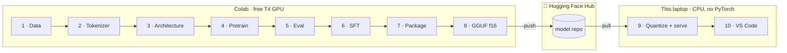

# tinyllm — an end-to-end LLM lifecycle

Build a language model from random initialization, publish it, quantize it, and chat with it in VS Code — walking every stage of the pipeline a real team uses.

The end artifact is a **15.7M-parameter Llama-architecture model** you trained yourself, living on the Hugging Face Hub, quantized to GGUF, and served on your own machine through `llama.cpp`.

It writes children's stories. It cannot write code, do arithmetic, or answer general questions — and understanding *why* a model this size can do the first thing but not the others is a good part of what this project teaches.

---

## Two tiers, and why

This project splits across two machines. That isn't a workaround for weak hardware — it's the shape of real ML infrastructure: **train on rented accelerators, deploy on the edge.**



The Hub is the **transport** between the tiers, not a bolt-on final step. Colab pushes; the laptop pulls. You end up learning the Hub by depending on it.

| Tier | Runs | Footprint |
|---|---|---|
| **Colab (T4)** | Stages 1–8: data, tokenizer, model, pretrain, eval, SFT, package, GGUF convert | Colab's disk |
| **This laptop** | Stages 9–10: quantize, serve, VS Code, quality analysis | **~700 MB, no PyTorch** |

### The hardware that forced this

| | |
|---|---|
| CPU | i5-6200U — 2 cores / 4 threads, 2015-era |
| GPU | Intel HD 520 — no CUDA |
| RAM | 32 GB |
| **Free disk** | **~2.1 GB** ← the binding constraint |

A PyTorch CPU install alone is ~1.2 GB unpacked. So the local tier is deliberately **torch-free**: `llama.cpp`'s prebuilt Windows binaries are 17 MB and need no cmake or MSVC, and everything analytical is done with `gguf` + `numpy` + `matplotlib`.

---

## Hugging Face access

One token, used in two places. Create it once at
**[huggingface.co/settings/tokens](https://huggingface.co/settings/tokens)** →
*Create new token* → type **Write** (write is required — stages 4/7/8 push).

| where | how | why |
|---|---|---|
| **Colab** | Secrets panel (🔑 in the left sidebar) → name `HF_TOKEN` → enable *Notebook access* | pushes checkpoints, the model, and the GGUF |
| **This laptop** | `.\.venv\Scripts\hf.exe auth login` — paste the token once | pulls the GGUF back down |

`hf auth login` writes the token to `%USERPROFILE%\.cache\huggingface\token`, and
every `huggingface_hub` call finds it automatically. No environment variable, and
nothing to set per-terminal.

Check it worked:

```powershell
.\.venv\Scripts\hf.exe auth whoami
```

> **The laptop step is optional if your model repo is public.** `push_to_hub()`
> creates it public by default, and public repos download without auth. Only the
> *checkpoint* repo is private, and that is only ever read from Colab. Logging in
> locally anyway costs 30 seconds and means nothing breaks if you later make the
> model private.

**Never paste a token into a notebook cell or commit one.** `.gitignore` covers
`.env` and `*.token`, but the Colab Secrets panel is the actual answer — it keeps
the value out of the notebook JSON entirely.

---

## Quickstart

**Prerequisites:** a GitHub repo (Colab clones from it), a Hugging Face token (above), and a Google account.

```powershell
# 1. Local setup: venv (no torch) + llama.cpp binaries. ~5 min, ~450 MB.
.\scripts\setup_local.ps1

# 2. Set your HF username in src/tinyllm/config.py  (HubConfig.user)
#    Then push this repo to GitHub.

# 3. In Colab: open notebooks/colab/01_data.ipynb, run 01 -> 08.
#    Store your token in Colab Secrets as HF_TOKEN.
#    Total ~1.5 h, of which ~45 min is the pretrain in notebook 04.

# 4. Back here: pull the model, quantize, serve.
.\scripts\pull_model.ps1
.\scripts\quantize.ps1
.\scripts\serve.ps1

# 5. Talk to it.
python clients\chat_cli.py
```

Print the config that drives everything:

```powershell
python src\tinyllm\config.py
```

---

## The ten stages

| # | Stage | Where | What you learn |
|---|---|---|---|
| 1 | [Data](docs/01-data.md) | Colab | Streaming corpora larger than disk; why TinyStories makes a 15M model viable |
| 2 | [Tokenizer](docs/02-tokenizer.md) | Colab | BPE training; why vocab size is a parameter-budget decision; a real GGUF landmine |
| 3 | [Architecture](docs/03-architecture.md) | Colab | RMSNorm, RoPE, GQA, SwiGLU — written from scratch, then proven equivalent to HF's |
| 4 | [Pretraining](docs/04-pretraining.md) | Colab | AMP, cosine schedules, gradient accumulation, durable checkpointing, MFU |
| 5 | [Evaluation](docs/05-eval.md) | Colab | Perplexity, sampling parameters, and the limits of both |
| 6 | [Instruction tuning](docs/06-sft.md) | Colab | Chat templates and completion-only loss masking |
| 7 | [Packaging](docs/07-hub.md) | Colab | safetensors, model cards, Hub repos as versioned artifacts |
| 8 | [GGUF conversion](docs/08-gguf.md) | Colab | How a training format becomes an inference format |
| 9 | [Quantization & serving](docs/09-quantization.md) | Local | K-quants, the quality/size curve, OpenAI-compatible serving |
| 10 | [VS Code](docs/10-vscode.md) | Local | Continue.dev, the OpenAI SDK, and honest expectations |

Start with **[docs/00-overview.md](docs/00-overview.md)** for the conceptual map.

---

## Repo map

```
src/tinyllm/          config.py is the single source of truth — change it and
                      the whole pipeline follows (vocab, shape, token budget,
                      step count are all derived).
notebooks/colab/      01–08, the GPU tier. Narrative wrappers over src/.
notebooks/local/      09–11, the CPU tier. No torch.
scripts/              PowerShell: setup, pull, quantize, serve.
clients/              chat_cli.py — streaming chat via the openai SDK.
continue/config.yaml  Copy to ~/.continue/config.yaml for the VS Code sidebar.
docs/                 One explainer per stage: what, why, what to look at.
models/               GGUF files land here (gitignored).
vendor/               llama.cpp binaries (gitignored).
```

---

## What to expect from the model

Honest calibration, so nothing reads as a bug:

- **Good at:** fluent, grammatical, coherent short children's stories with a beginning, middle, and end. Following simple story instructions after Stage 6.
- **Bad at:** everything else. It has ~15M parameters and an 8192-token vocabulary trained exclusively on synthetic children's stories. It will confidently produce nonsense outside that domain.
- **In the VS Code sidebar** it is configured for `chat` only. Giving it `autocomplete` or `edit` roles would produce garbage — see [docs/10-vscode.md](docs/10-vscode.md).
- **At Q4_K_M** quality drops more than quantization folklore suggests. That folklore is written for 7B+ models; small models have far less redundancy to absorb rounding error. Stage 9 measures this rather than assuming it.

---

## License / credits

Trained on [TinyStories](https://huggingface.co/datasets/roneneldan/TinyStories) (CDLA-Sharing-1.0). Inference via [llama.cpp](https://github.com/ggml-org/llama.cpp). Architecture follows Llama; implementation is original.
